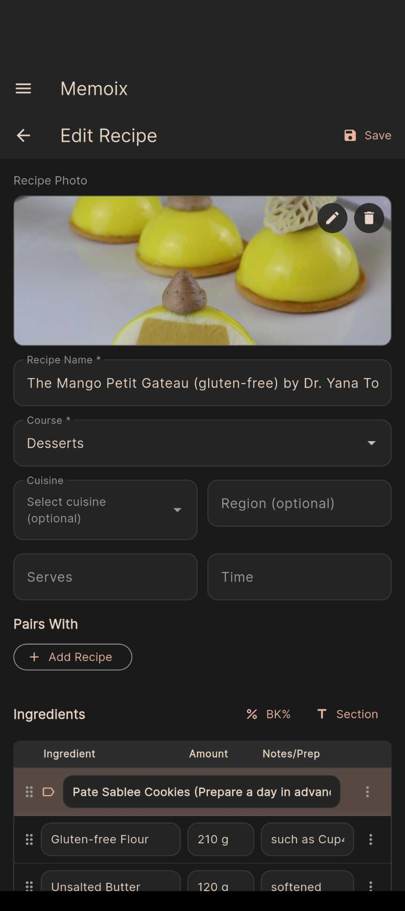

# Memoix

<p align="center">
  
</p>

Memoix is a recipe and food reference app for people who cook seriously.

It prioritizes speed, clarity, and flexibility over gamification or beginner scaffolding. Recipes, techniques, logs, and notes live side-by-side, with support for workflows that don't fit neatly into "ingredients + steps".

This project started as a personal tool and is evolving into something others can use and extend.

---

## What Memoix Is (and Isn’t)

Memoix is built for:

- Professional cooks
- Serious home cooks
- People who care about *how* and *why* something is made

It intentionally avoids:

- Difficulty ratings
- Social feeds
- Engagement mechanics
- Forced structure where it doesn't belong

Some sections are recipes. Others are reference logs, technique notes, or memory aids. That distinction is deliberate.

---

## Core Features

**Flexible recipe model**  
Supports conventional recipes as well as non-traditional formats: 

- Smoking Notes
- Pizza Compositions
- Modernist Techniques
- Personal Shorthand

**OCR import**  
Capture recipes from photos of books, notebooks, or printed pages.

**URL import**  
Import recipes from websites and normalize them into Memoix's data model.

**Side-by-side cooking view**  
Ingredients and directions displayed together for hands-free use.

**Offline-first**  
Local database. No account required. No cloud dependency.

**Reference logs**  
Dedicated sections for things that aren't recipes (cheese notes, cellar inventory, etc.).

---

## Screenshots

<p align="center">
  
  
  
</p>

<p align="center">
  
  
</p>

---

## Designed for Real Cooking

Memoix includes a number of small behaviors intended to reduce friction during actual cooking and reference use.

- Recipe steps can be marked as completed to help you keep your place
- Different cuisines expose different configuration options where relevant
- Recipes can be viewed in multiple layouts depending on context
- Some sections are not recipes at all, but logs or reference material
  
---

## Platform Support

| Platform | Status |
|----------|--------|
| Android  | Supported |
| Windows  | Supported |
| macOS    | Supported |
| iOS      | Builds, but untested |
| Linux    | Planned |

Built with Flutter. Web is not currently targeted.

---

## Project Status

Memoix is in **active development** and approaching an initial public beta.

The core application is functional. Ongoing work is focused on OCR accuracy, URL parsing coverage, and polish.

Expect rough edges.

---

## Architecture

```
┌─────────────────────────────────────────────┐
│                   MEMOIX                    │
├─────────────────────────────────────────────┤
│  Local Collections                          │
│    Recipes · Techniques · Logs · Reference  │
│                                             │
│  Import Layers                              │
│    OCR · URL parsing                        │
│                                             │
│  Presentation                               │
│    Cuisine views · Cooking mode layouts     │
├─────────────────────────────────────────────┤
│  Local Database (Isar) · Offline-first      │
└─────────────────────────────────────────────┘
```

---

## Getting Started (Development)

### Requirements

- Flutter SDK 3.2+
- Platform toolchains for your target OS (Android SDK, Xcode, Visual Studio, etc.)

### Setup

```bash
git clone https://github.com/dboiago/Memoix.git
cd Memoix
flutter pub get
dart run build_runner build
flutter run
```

### Build Targets

```bash
flutter build apk      # Android
flutter build ios      # iOS (requires macOS + Xcode)
flutter build windows  # Windows
flutter build macos    # macOS
```

---

## Project Structure

```
lib/
  app/          Application shell, routing, theming
  core/         Database, services, shared logic
  features/     Feature-scoped UI and state
  shared/       Reusable widgets and utilities

recipes/
  JSON recipe collections used for sync and reference
```

---

## Contributing

This project is opinionated and evolving.

If you want to contribute:

- Focus on correctness and restraint
- Avoid adding features that increase surface area without clear value
- Read existing patterns before introducing new ones

Issues and pull requests are welcome, but this is not a generic "recipe app" by design.

---

## License

PolyForm Noncommercial License 1.0.0. See [LICENSE](LICENSE) for details.

---

## Acknowledgements

- [Flutter](https://flutter.dev)
- [Isar](https://isar.dev)
- [Google ML Kit](https://developers.google.com/ml-kit) (OCR)
- [Riverpod](https://riverpod.dev)

---


Built with salt.
