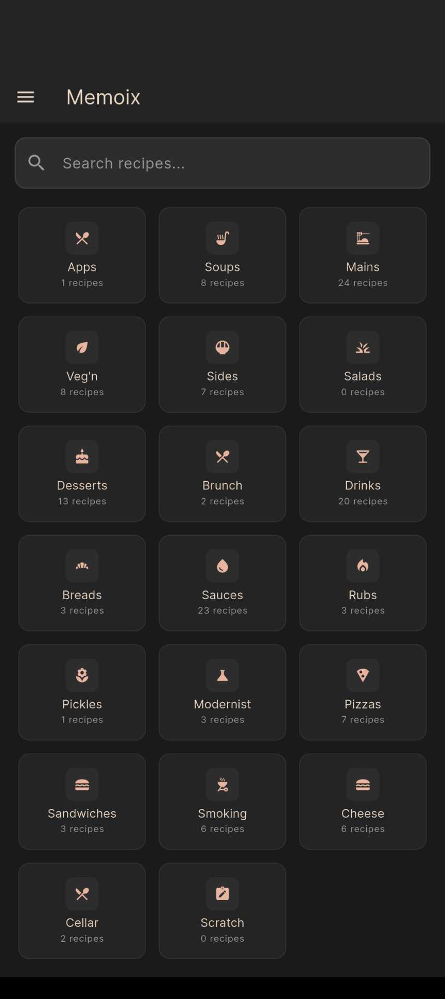
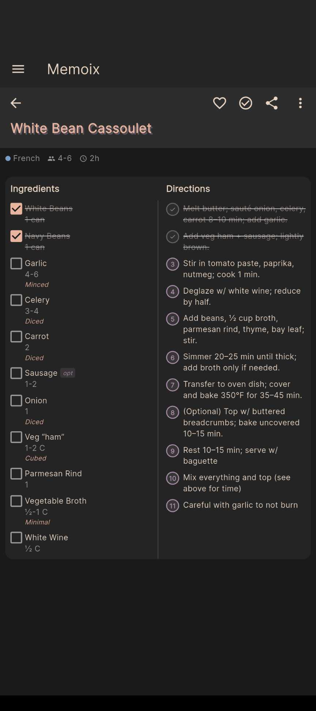
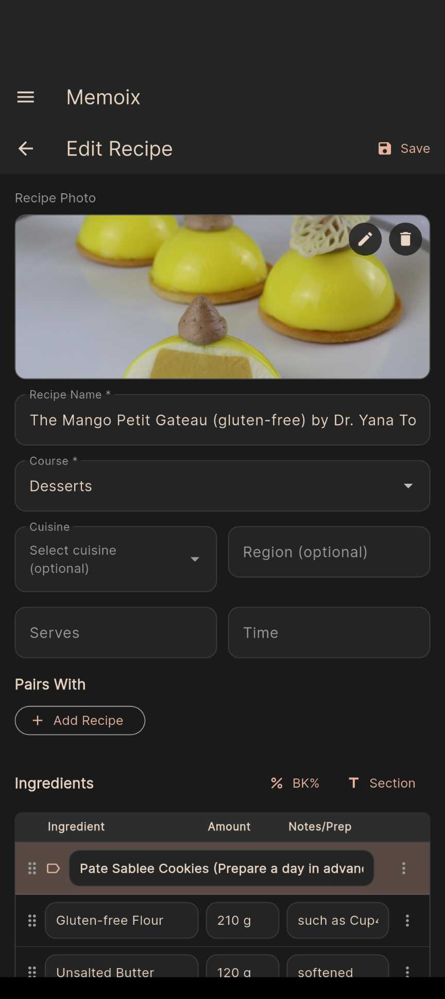
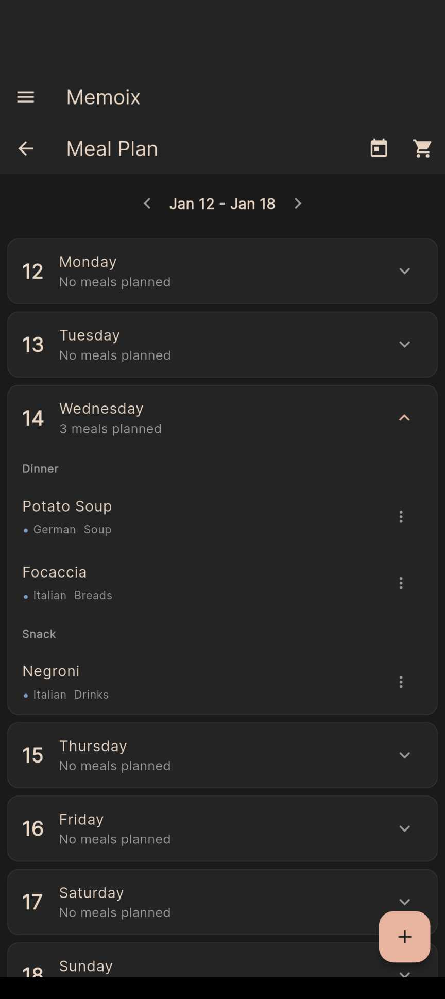
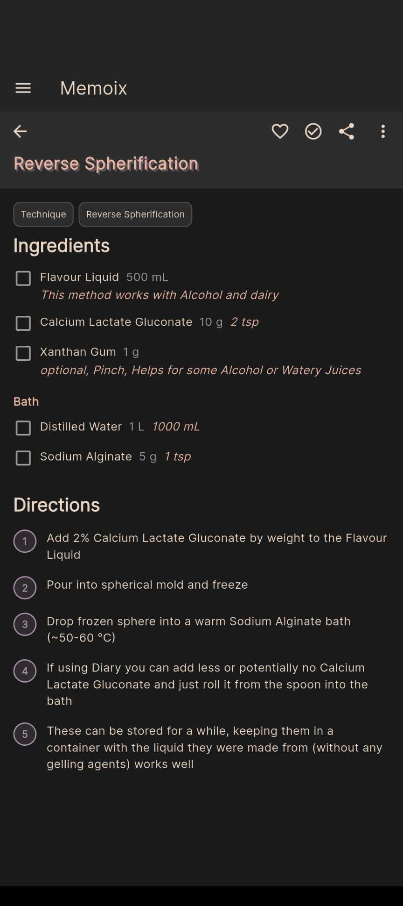

# Memoix

<p align="center">
  
</p>

Memoix is an offline-first recipe and culinary reference app built for real cooking

It prioritizes speed, clarity, and flexibility over structure, guidance, or engagement mechanics. Recipes, techniques, logs, and notes live side-by-side to reflect how cooking actually happens.

---

## What Memoix Is (and Isn't)

Memoix is built for:

- Professional cooks  
- Serious home cooks

It intentionally avoids:

- Social features  
- Ratings, reviews, or discovery systems  
- Forced structure where it doesn't belong

Some entries are complete recipes. Others are reference logs, technique notes, or working records. That distinction is deliberate.

Memoix does not rely on AI as part of the product surface. It is available only as an optional tool, invoked explicitly by the user.

---

## Core Features

**Flexible recipe model** 
Supports conventional recipes as well as formats that don’t map cleanly to ingredients + steps

- Smoking notes  
- Pizza and sandwich compositions  
- Modernist techniques and process notes  
- Personal notes and partial records  

**Import tools**

- OCR for books, notebooks, and printed material
- URL import for web recipes
- QR code and deep link import (`memoix://` scheme)
- Optional AI-assisted import for difficult formats (requires user-provided API key)

**Cooking views**  

- Ingredients and directions shown side-by-side
- Step state tracking  
- Direction-triggered timers  
- Multiple layouts depending on context  

**Ingredient handling**  

- Normalization and parsing at import  
- In-session scaling based on serving size
- Optional AI-backed reference and substitution lookup

**Reference layers**  
Not everything is a recipe:

- Cheese and cellar logs  
- Technique notes  
- Process-specific records

**Kitchen tools**  

- Standalone kitchen timer
- Measurement converter
- Recipe comparison
- Shopping lists
- Meal planning
- Cooking logs and recipe statistics

---

## Data Model and Storage

Memoix is fully functional without a network connection.

- Local-first SQLite database (Drift)  
- Relational structure with explicit query layers
- No account required  
- No dependency on external services  

Data remains complete and usable on-device at all times.

### Backup and Sync

Backup is user-controlled and optional:

- Local device storage (default)  
- Google Drive or OneDrive integration (one provider at a time)
- Personal and shared backup locations supported  

---

## Screenshots

<p align="center">
  
  
  
</p>

<p align="center">
  
  
</p>

---

## Platform Support

| Platform | Status |
|----------|--------|
| Android  | Supported |
| Windows  | Supported |
| macOS    | Builds, untested |
| iOS      | Builds, untested |
| Linux    | Unverified |

Built with Flutter.

---

## Project Status

Memoix is in active development and approaching public release.

Core systems are stable: database layer, import pipelines, and cooking workflows. Current work is focused on import accuracy, edge-case handling, and general refinement.

Expect rough edges.

---

## Architecture

```

┌─────────────────────────────────────────────┐
│                   MEMOIX                    │
├─────────────────────────────────────────────┤
│  Data Model                                 │
│    Recipes · Techniques · Logs · Reference  │
│                                             │
│  Import Systems                             │
│    OCR · URL · QR · AI (optional)           │
│                                             │
│  Execution                                  │
│    Cooking views · Timers · Scaling         │
├─────────────────────────────────────────────┤
│  Local Database (SQLite via Drift)          │
│  State Management (Riverpod)                │
│  Offline-first · No required services       │
└─────────────────────────────────────────────┘

````

---

## Getting Started (Development)

### Requirements

- Flutter SDK 3.2+  
- Platform toolchains for your target OS  

### Setup

```bash
git clone https://github.com/dboiago/Memoix.git
cd Memoix
flutter pub get
dart run build_runner build
flutter run
````

### Build Targets

```bash
flutter build apk
flutter build ios
flutter build windows
flutter build macos
```

---

## Project Structure

```
lib/
  app/          Application shell, routing, theming
  core/         Database (Drift), DAOs, services
  features/     Feature-scoped UI and state
  shared/       Reusable widgets and utilities
```

---

## Contributing

This project is opinionated and evolving.

If you want to contribute:

* Favour precision over feature breadth
* Avoid abstraction that obscures behavior
* Match existing patterns before introducing new ones

Pull requests are welcome, but additions should align with the existing direction.

---

## License

PolyForm Noncommercial License 1.0.0. See [LICENSE](LICENSE) for details.

---

## Acknowledgements

* Flutter
* Drift (SQLite)
* Google ML Kit (OCR)
* Riverpod

---

Built with salt.